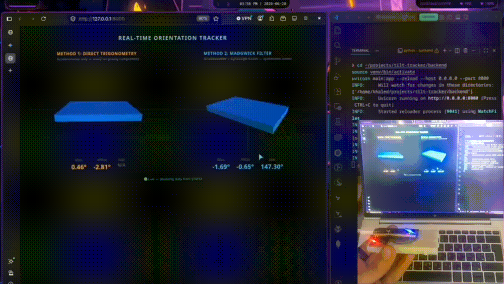

# Tilt Tracker — Real-Time IMU Orientation Dashboard

A full-stack embedded systems project that streams real-time orientation data from an STM32 microcontroller to a live 3D browser dashboard.

The project compares two orientation-estimation approaches side by side:

- **Direct accelerometer trigonometry** using `atan2()`
- **Madgwick sensor fusion** using accelerometer + gyroscope data

The system demonstrates hardware interfacing, sensor-fusion mathematics, embedded timing, USB serial communication, asynchronous backend processing, WebSockets, and browser-based 3D visualization.

## Overview

### Hardware

- **Microcontroller:** STM32F401CEU6 (Black Pill)
- **Sensor:** MPU6050 6-axis IMU
- **Communication:** I²C between STM32 and MPU6050
- **USB:** USB CDC virtual serial port

### Software

- **Firmware:** C++ / Arduino framework via PlatformIO
- **Backend:** Python, FastAPI, PySerial, WebSockets
- **Frontend:** HTML5, Vanilla JavaScript, Three.js

## System Pipeline

```text
MPU6050
   │
   │ I²C @ 400 kHz
   ▼
STM32F401CEU6
   │
   │ Orientation computation
   │ ├── Direct trigonometry
   │ └── Madgwick filter
   │
   │ JSON over USB CDC
   ▼
Python / FastAPI Backend
   │
   │ WebSocket
   ▼
Three.js Browser Dashboard
   │
   ├── Trigonometric orientation
   └── Madgwick orientation
```

## Firmware

The STM32 firmware runs a simple three-state system:

```text
INIT ───────────────► RUNNING
 │                       │
 │ sensor failure        │ repeated read failure
 ▼                       ▼
ERROR ◄──────────────────┘
```

### Sensor Interface

The MPU6050 communicates with the STM32 through hardware I²C:

| MPU6050 Pin | STM32 Pin | Description |
|---|---|---|
| VCC | 3V3 | 3.3 V supply |
| GND | GND | Common ground |
| SCL | PB6 | I²C clock |
| SDA | PB7 | I²C data |
| AD0 | Unconnected | Default address `0x68` |

The I²C bus is configured for **400 kHz Fast Mode**.

### Timing

The main loop targets **100 Hz** using a 10 ms timing gate.

Instead of assuming a perfectly fixed time step, the firmware measures the actual elapsed time between loop iterations and passes that value to the Madgwick filter. This accounts for small timing variations during sensor acquisition and processing.


### Error Handling

MPU6050 read failures are retried before the firmware attempts to reinitialize the sensor.

If the sensor cannot be recovered after repeated failures, the system enters an error state and uses the onboard LED to indicate the failure.

## Orientation Estimation

### 1. Direct Trigonometry

The first method uses only accelerometer measurements.

Roll and pitch are calculated from the gravity vector using `atan2()`:

```text
roll  = atan2(ay, az)

pitch = atan2(-ax, sqrt(ay² + az²))
```

#### Advantages

- Simple and computationally lightweight
- Does not accumulate gyroscope drift
- Easy to interpret mathematically

#### Limitations

- Sensitive to movement and vibration
- Assumes acceleration is dominated by gravity
- Cannot determine yaw without an external heading reference such as a magnetometer

### 2. Madgwick Filter

The second method combines accelerometer and gyroscope measurements using a quaternion-based Madgwick filter.

The gyroscope provides responsive rotational information while the accelerometer provides a gravity reference for correcting long-term drift.

The firmware outputs:

- Roll
- Pitch
- Yaw

Quaternion representation also avoids the gimbal-lock limitations associated with directly representing orientation using Euler angles internally.

Without a magnetometer, yaw remains subject to long-term drift.

## Data Flow

The firmware sends orientation data as compact JSON packets over the STM32 USB CDC serial connection:

```json
{
  "tr": 0.00,
  "tp": 0.00,
  "mr": 0.00,
  "mp": 0.00,
  "my": 0.00
}
```

Where:

- `tr` — trigonometric roll
- `tp` — trigonometric pitch
- `mr` — Madgwick roll
- `mp` — Madgwick pitch
- `my` — Madgwick yaw

The FastAPI backend reads the serial stream in a background task and broadcasts each valid reading to all connected browser clients through WebSockets.

A REST endpoint at `/api/latest` is also provided for retrieving the most recent reading.

## Backend Architecture

The backend acts as a small real-time data pipeline:

```text
STM32
  │
  │ USB Serial
  ▼
Serial Reader
  │
  │ latest reading
  ▼
FastAPI
  │
  ├── WebSocket /ws
  │      └── Browser clients
  │
  └── REST /api/latest
```

Blocking serial reads are executed outside the asyncio event loop so that WebSocket connections can continue to be handled concurrently.

The backend automatically searches for the STMicroelectronics USB device by vendor ID and falls back to `/dev/ttyACM0` if automatic detection does not find a matching port.

## Dashboard

The browser dashboard uses Three.js to render two synchronized 3D models:

- **Direct Trigonometry:** roll + pitch
- **Madgwick Filter:** roll + pitch + yaw

Numeric angle readouts are displayed below each visualization.

The dashboard automatically reconnects to the WebSocket if the backend connection is interrupted.

## Demo



[Full demonstration video (MP4)](demo/tilt-tracker-demo.mp4)

## Installation

### 1. Clone the Repository

```bash
git clone https://github.com/khaled-hoshan/tilt-tracker.git
cd tilt-tracker
```

### 2. Flash the Firmware

Install PlatformIO, then:

```bash
cd firmware
pio run --target upload
```

The project is configured to use the STM32 USB DFU bootloader.

### 3. Start the Backend

Python 3.8 or newer is recommended.

```bash
cd ../backend

python -m venv venv

# Linux/macOS
source venv/bin/activate

# Windows
# venv\Scripts\activate

pip install -r requirements.txt

uvicorn main:app --reload --port 8000
```

### 4. Open the Dashboard

Open:

```text
http://localhost:8000
```

Connect the STM32 to the computer through USB. The backend will detect the STM32 serial device and begin streaming orientation data.

## Error Indication

The STM32 onboard LED (PC13) indicates system state:

| LED State | Meaning |
|---|---|
| Off | Initialization in progress / inactive |
| Solid On | System running normally |
| Blinking | Fatal sensor or communication error |

## Project Structure

```text
tilt-tracker/
├── firmware/
│   ├── include/
│   │   ├── madgwick.h
│   │   └── mpu6050.h
│   ├── src/
│   │   ├── madgwick.cpp
│   │   ├── main.cpp
│   │   └── mpu6050.cpp
│   ├── lib/
│   └── platformio.ini
├── backend/
│   ├── main.py
│   └── requirements.txt
├── frontend/
│   └── index.html
├── demo/
│    ├── tilt-tracker-demo.gif
│    └── tilt-tracker-demo.mp4
├── README.md
└── LICENSE
```

## Technologies

- C++
- Arduino Framework
- PlatformIO
- STM32F401CEU6
- MPU6050
- I²C
- Python
- FastAPI
- PySerial
- WebSockets
- HTML5
- JavaScript
- Three.js
- WebGL
- Quaternion-based sensor fusion
- Madgwick filter

## Academic Context

Developed as part of a fourth-year Computer Engineering project.

The project combines embedded systems, sensor interfacing, orientation estimation, real-time communication, backend processing, and browser-based visualization.
